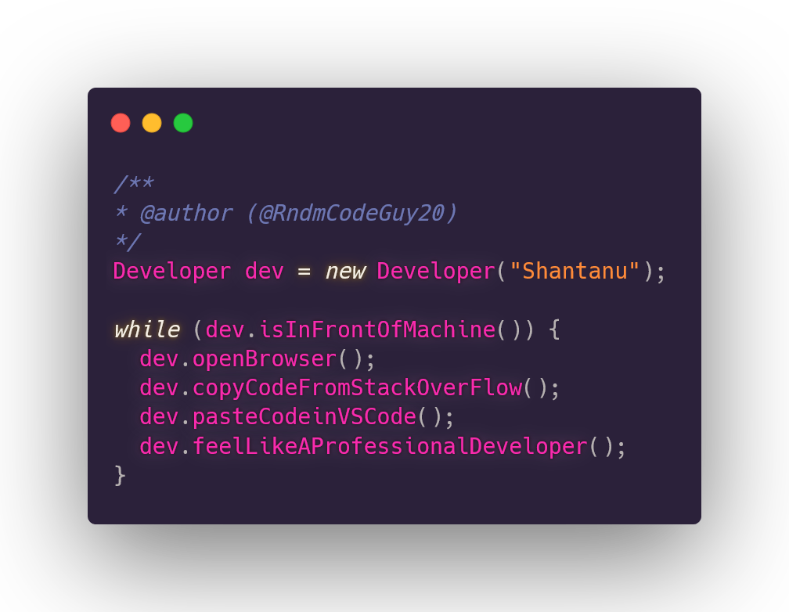

# Ohh! So you finally found me! Great!!!👋🤘🤙

 

## Hello There! I am [Shantanu Mane](https://github.com/RndmCodeGuy20)!&nbsp;

<div>
 
 
- 💻 I'm a Programmer! <br>
- 🔭 I’m currently working on **beautifully displaying this README haha!** <br>
- 🌱 I’m currently learning **Machine Learning, Cloud Computing, Data Structures and Algorithms** <br>
- 👯 If you have any projects you would like to collaborate, reach out to me.<br>
- 💬 Ask me about **anything (I'll surely give you an answer, regardless of whether it is correct or not  )** <br>
- ⚡ Fun fact: I casually like to play the piano / keyboard / synthesizer🎹 <br>
</div>
<div>

</div>
<h2></h2>
<!-- Using blank h2 element for giving horizontal line. I know I can use use <hr> but I want to use this only 😤 -->

<em><b>I love connecting with different people</b> so if you want to say <b>hi, I'll be happy to meet you more!</b> :blush:</em>
<br>


<a target="_blank" href="https://rndmcodeguy20.github.io/ManeShantanu-Portfolio/"></img></a>
### Spotify Playing 🎧

[](https://open.spotify.com/user/vn07i7j19cx52zx7o8rotbm8b)
<h2></h2>

<div>
 
### Languages in which I can write 'Hello World' in: <br>
 
 
 
 
  
  
  
  
  
  
  
  
  
  
  ### Frameworks I like to work with:
  
  
  
  
  

 
### Some softwares I design my UI in :
  
  
  
  
  
  
  ### My favorite Softwares / Editors / IDEs :
  
  
  
    
  
  

 ### Places I learn new technologies from :
  
  
  
  
  
  
  
  
  

### My overview: 
<br>
<div align="center">
 
 [](https://github.com/anuraghazra/github-readme-stats) &nbsp;&nbsp;&nbsp;&nbsp;&nbsp;&nbsp;&nbsp;&nbsp;  [](https://github.com/anuraghazra/github-readme-stats)
 
 </div>

<!-- [](https://github.com/anuraghazra/github-readme-stats) -->

<div align="center">

[](https://github.com/anuraghazra/github-readme-stats)


</div>
<h2></h2>

### Nothing to see here...

<!-- wi*quL3fcV -->

```javascript
// Which came first: the chicken or the egg?
console.log(["🥚", "🐣", "🐥", "🐔"].sort()) 
>>> ["🐔", "🐣", "🐥", "🥚"];
```
<h2></h2>
<!--START_SECTION:waka-->
<!--END_SECTION:waka-->
<h2></h2>


<!-- Optional Visitors badge: -->


⭐️ From [Shantanu Mane](https://github.com/RndmCodeGuy20/RndmCodeGuy20)
---
> Yeah, Science...

<br />


<!-- ```C

#include <stdio.h>

int main(){
  printf("Hey!");

return 0;
}
``` -->
<!--  -->
