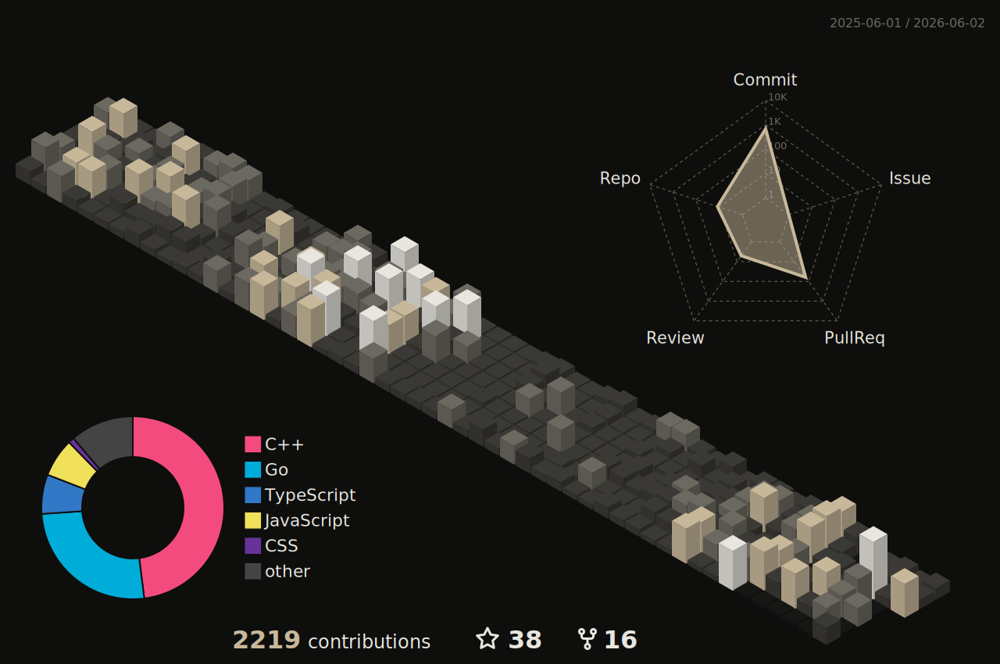

<!-- hero image -->

  

---

### engineer / tinkerer / builder

i build systems that are predictable, observable, and slightly over-engineered on purpose.

---

## now

- building a leetcode-like ML judge with sandboxed execution (go + containers)
- exploring observability (opentelemetry, lgtm stack)
- refining server-driven UI systems

---

## work

- **nudge core**  
  server-driven UI + templating + runtime orchestration

- **og image pipeline**  
  browser-rendered visuals using workers + edge compute

- **ml judge system**  
  containerized execution engine for evaluating models/code

---

## activity

  

  
  &nbsp;&nbsp;
  

---

## notes

i document how things actually work — failures included.

→ https://notebook.rndmcode.in

---

## contact

- site → https://notebook.rndmcode.in
- mail → maneshantanu.20@gmail.com
- github → you're already here
