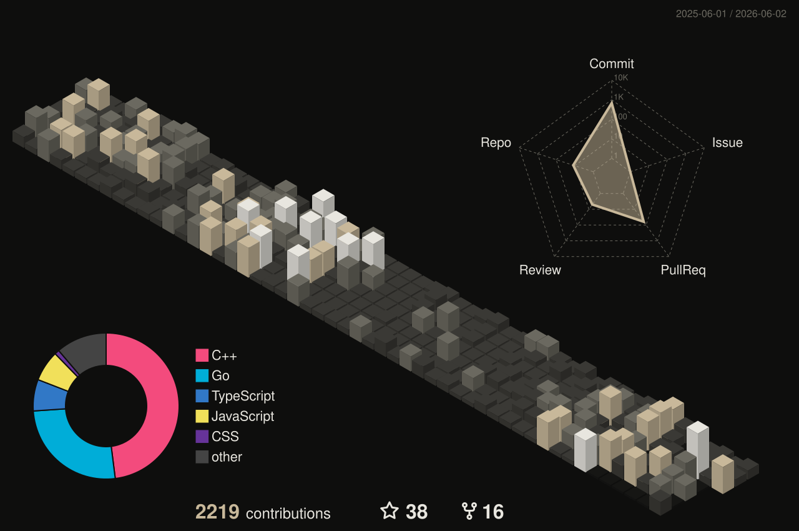

<!-- hero image -->

  

---

### builder of things that mostly work

i write code that is supposed to be boring in production and interesting in the commit history.
most of my systems ship a kill switch. i have never needed one. i keep it anyway.

---

## now

<!--START_SECTION:now-->
- dotmind → https://github.com/RndmCodeGuy20/dotmind, 5 commits this week
- RndmCodeGuy20 → https://github.com/RndmCodeGuy20/RndmCodeGuy20, 1 commit this week
<!--END_SECTION:now-->

*updates weekly, ranked by commits in the last 7 days*

---

## work

**[sentinel](https://github.com/RndmCodeGuy20/sentinel)**  
hardened docker sandbox for untrusted code. 11 layers of defense between a stranger's solution.py and the host, and the runner itself is not allowed to know if the answer was right.  

**[mpiper](https://github.com/RndmCodeGuy20/mpiper)**  
media processing pipeline, go api and python workers arguing over redis streams. bounded worker pool gets ~2.4x throughput, dead letters get a stream of their own instead of getting dropped on the floor.  

**[golem](https://github.com/RndmCodeGuy20/golem)**  
the orchestrator sentinel answers to. spins up ephemeral containers, claims jobs off redis streams, decides verdicts so the sandbox doesn't have to.  

**[notebook](https://github.com/RndmCodeGuy20/notebook)**  
this portfolio's actual home. tracks every visitor scroll over sse and redis pub/sub, mostly so i can watch nobody scroll past the hero section in real time.  

**[mini_dns](https://github.com/RndmCodeGuy20/mini_dns)** (aegis)  
an esp32 that resolves hostnames, sinkholes ad domains, and serves a crud api and prometheus metrics, all on a chip smaller than the badges below.  

---

## activity

  

---

## notes

i write down what actually happened, not what the postmortem template wants me to say happened.

→ https://notebook.rndmcode.in

---

## contact

- site → https://notebook.rndmcode.in
- mail → maneshantanu.20@gmail.com
- github → you're already here, might as well star something
- response time → faster for bug reports than for "quick questions"
