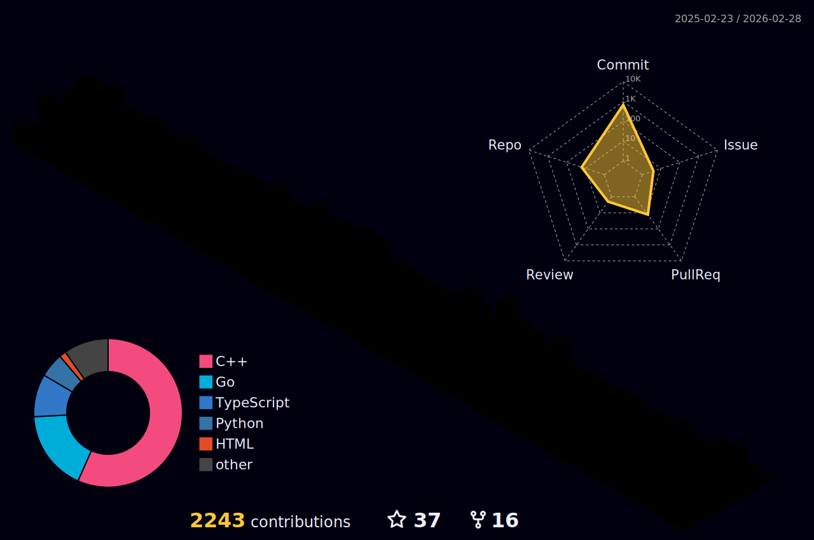
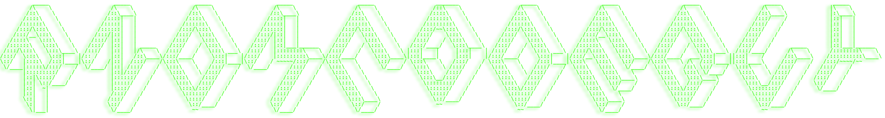

Currently a sophomore at SRCOEM, pursuing my bachelor's degree in Computer Science Engineering with a specialization in AI and ML.

- 💻 I'm a Developer!  
- 🔭 I’m currently working on maintaining my **sanity**...  
- 🌱 I’m currently learning **Embedded Coding, Deep Learning, Backend Development and IoT.**  
- 👯 If you have any projects you would like to collaborate, reach out to me on my [website]('https://maneshantanu.herokuapp.com'). 
- 🚵 Trying to make this world a better place...  
- ⚡ Fun fact: I casually like to play the 🎹  

### ☎️ Ways to reach me 👉

<!--START_SECTION:activity-->

1. 🎉 Merged PR [#4](https://github.com/RndmCodeGuy20/RndmCodeGuy20/pull/4) in [RndmCodeGuy20/RndmCodeGuy20](https://github.com/RndmCodeGuy20/RndmCodeGuy20)
2. ❗️ Opened issue [#1932](https://github.com/Vishal-raj-1/Awesome-JavaScript-Projects/issues/1932) in [Vishal-raj-1/Awesome-JavaScript-Projects](https://github.com/Vishal-raj-1/Awesome-JavaScript-Projects)
3. 💪 Opened PR [#2782](https://github.com/ossamamehmood/Hacktoberfest2022/pull/2782) in [ossamamehmood/Hacktoberfest2022](https://github.com/ossamamehmood/Hacktoberfest2022)
4. 🗣 Commented on [#226](https://github.com/Keerat666/LeetCode-HacktoberFest22/issues/226) in [Keerat666/LeetCode-HacktoberFest22](https://github.com/Keerat666/LeetCode-HacktoberFest22)
<!--END_SECTION:activity-->

<!----->

### 🧑‍💻 My Tech Stack 🤖

#### 🎃 Languages I Use

#### 🪟 Frameworks I Use

#### 💾 Database(s) I Use

####  IDEs I Use

#### 🦿 Electronics I Use

## ⭐️ From [Shantanu Mane](https://github.com/RndmCodeGuy20/RndmCodeGuy20)

 

<!-- #image --> <!-- #end -->
